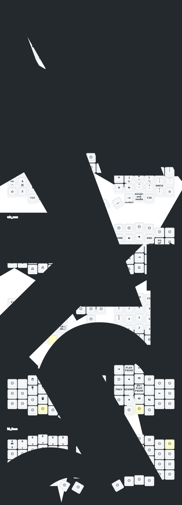

# Sofle
Fork of the ZMK Eyelash firmware most Aliexpress sellers use, just with my own keymap.

Original READMEs:
- [English](README_EN.md)
- [中文](README.md)

## Quick-Start Guide
1. Grab latest firmware from Actions tab. For each half:
2. Plug in via USB.
3. Double-tap back button → USB drive appears.
4. Drag settings_reset.uf2 → drive vanishes.
5. Double-tap again → drive returns.
6. Drag correct UF2:
    - Left: `eyelash_sofle_studio_left.uf2`
    - Right: `nice_view_custom-eyelash_sofle_right-zmk.uf2`

## Sofle Keymap (Auto-updated by Github Actions)

